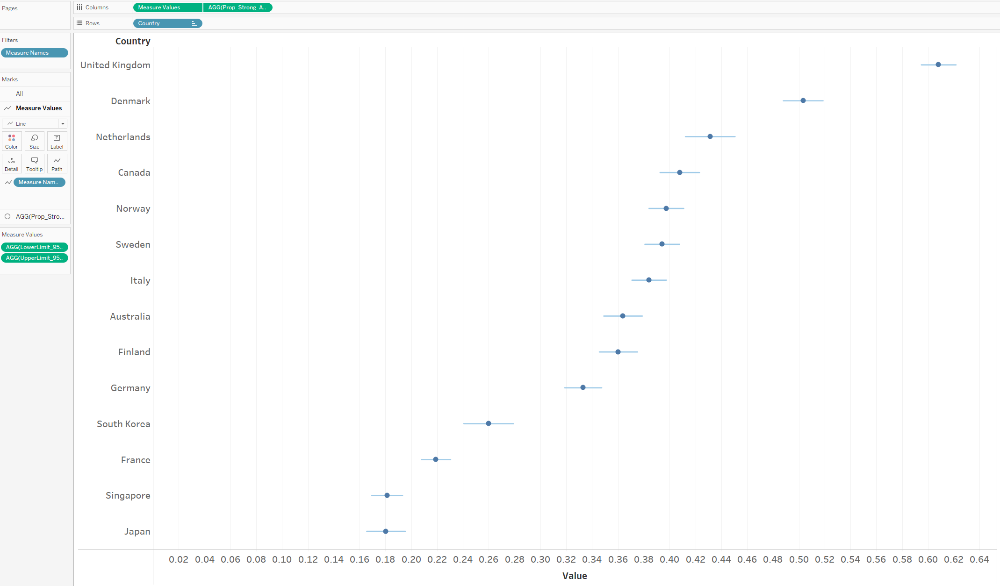

```{r setup, include=FALSE}
knitr::opts_chunk$set(echo = FALSE)
```

# Initial Visualization


# Critiquing the Initial Visualization

### Clarity

1. The titles of the charts are not well-worded. Firstly, the chart is intended to show the willingness of the countries' residents to take the Covid-19 vaccination. This can easily be misunderstood, because the title "Which country is more pro-vaccine?" could be easily misconstrued as an indication of the political landscape in the country instead of the sentiment of the people. Secondly, this is a result of polling a sample of the countries' populations. Therefore the title should NOT be driving the message that these are the results for the entire country. This applies to both titles.

2. The chart on the right is providing a subset of information that already exists in the first chart on the left. However, due to how the countries have been sorted differently in both charts, this is not apparent. Therefore in its current state, the chart on the right is essentially redundant if the stacked bar chart (left) was neatly sorted in descending order of "Strongly Agree" proportions with a clear legend.

3. The uncertainty of the data is not addressed in the visualization. These study results are based off a sample of each country's population, therefore, there must be a a confidence interval shown to the reader for each point estimate per country.

4. The stacked bar chart on the left is not clearly showing the disparity between those who are willing to take the Covid vaccine versus those who are not, as it is just stacking the proportion of survey scores 1 through 5.

### Aesthetics

1. Color usage in the stacked bar chart is not appropriate. Using a variety of colors to represent the differences between "Strongly agree" all the way to "Strongly Disagree" does not help much visually.

2. The stacked bar chart is not sorted well. It is challenging to the eyes to pick out a trend quickly.

3. The tick marks on the x-axis are too light and almost invisible.

## Suggestions for Graphical Presentation

The following table summarizes the key changes recommended to the initial visualization:

| Aspect | Critique | Recommendation |
| :---: | :-----------------------------: | :-------------------------------------------------------: |
|   Clarity   |   The titles of the charts are not well-worded.   |  Either a comprehensive lead-in statement should be provided, or a well-worded title should be used that captures the essence of the visualization    |
|   Clarity   |   The chart on the right is providing a subset of information that already exists in the first chart on the left.   |  If two charts are to be used, they should each serve a unique purpose which when combine, enhances the audience's understanding of the visualization. Recommendation here is to use a combaination of a Likert Chart and an Error Bar chart.    |
|   Clarity   |   The uncertainty of the data is not addressed in the visualization.   |   An Error Bar chart can address this gap in clarity by showing the confidence interval ranges.   |
|   Clarity   |   The stacked bar chart on the left is not clearly showing the disparity between those who are willing to take the Covid vaccine versus those who are not. |   A Likert Scale would be a better choice to visually represent the skew between willing and unwilling participants of the Covid vaccine.   |
|   Aesthetics   |  Color usage in the stacked bar chart is not appropriate.  | Here, using a sequential color scale would be better, regardless of whether it is single hue or multi hue.   |
|   Aesthetics   | The stacked bar chart is not sorted well.   |   The chart should be sorted either in ascending or descending order of score proportions per country.    |
|   Aesthetics   |  The tick marks on the x-axis are too light and almost invisible.  |  A better choice of opacity level should be employed when it comes to tick marks that can visually aid the readers of the chart.  |

## Sketch of proposed visualization


### Key characteristics of proposed visualization:

- Using the Likert Scale will help us to visualize clearly between positive, negative and neutral sentiments of the public.
- Using an error bar chart helps us to see the range in which the proportion of "strongly agree" responses are likely to swing within the total population, using a confidence interval of 95%.
- Having selection and slider fields for factors such as age, employment status and household size will enable the audience to interact with the dashboard to have a customized view of the scope of data that they would like to see.

# Preparing the Proposed Visualization with Tableau


## Importing Data into Tableau & Data Preparation

1. An important observation of the raw data is that there are many blank cells in the columns related to the key survey question "If a Covid-19 vaccine were made available to me this week, I would definitely get it". This holds true for the remaining survey questions as well. Therefore, it would be necessary to exclude these data points eventually in the visualization.

2. A quick look at the raw data shows us that there are many other countries' data also available in the data download provided. To maintain consistency in the scope of this makeover, we will keep to the 14 countries in the original visualization. Thus, the remaining countries' data is removed from the folder.

3. Now, we drag & drop the first country file in the data folder(australia.csv) into Tableau. We will notice that Tableau automatically recognizes the rest of the country files in the folder.


4. As each country's data is in separate csv files, it is essential to first combine them into one large dataset. To do so, we will start by removing the australia.csv that is by default placed on the logical table:


5.Drag and drop the "New Union" option into the logical platform & we will see a box opened for customized unions:


6. Drag and drop all 14 countries into the Union box and press "OK":


7. Now we are able to see the dataset, and it is time to make a few modifications so that we can use the data conveniently in a visualization:
  + As we will be focusing on the vac_1 column, lets start here. First, we will use a filter to remove all null fields. In the check box the follows after pressing "OK", select all responses except "Null".

  
  
  + Notice that only survey responses 1 & 5 have text tagged to them. We need to standardize this column to a number. To do this we use a custom split to use the hyphen "-" as separator:
  
 

  + We will notice now that Response 5 has not been split successfully while response 1 has:


  + This is because the separator is actually different for Responses 1 & 5. One is a hyphen and the other is a subtract sign. Repeat the Custom split on the new column, using same steps as above to take care of Response 5, and we should now have a column that has the text removed.
  + Following this, rename the column to "vac_1_final" and convert the data type to Number(whole). We will now use this for all further work on the visualization:
  


  + Rename the "table_name" column to "Country, and use Aliases option to type the country name, so that we get a clean look later in the visualization:


  + We are now done with basic data preparation. It is time to move on to creating several calculated fields that we will require for both the Likert Chart as well as the Error Bar Chart.

## Creation of Calcuated Fields for Likert Chart

There are several calculated fields we need to create. For all calculated fields, we go to the Sheet Page --> "Analysis" --> "Create Calculated Field", and then type in the formulas:


1. Number of Records - This will essentially mark each data row with a value of 1, which will help us greatly when counting:


2. Total Count - This helps us to sum up the Number of Records across a table:


3. Count_Neg_Vac_1 - This is for us to maintain a count of the scores that we consider negative. The logic is to apply a count of 1 to scores "4" and "5", while assigning a value of 0.5 to the neutral score 3, so that it can be evenly spread across the 0 score of the Likert Scale:


4. Total_Count_Negative_Vac_1 - This field is used to count the total number of scores we consider negative.


5. Percentage - This is used to calculate the contributing percentage of each survey response per country.


6. Gantt_Start_Vac_1 - This calculation determines the starting points on the Likert Scale


7. Gantt_Percent_Vac_1 - This is a formula to calculate the start/end points on the scale to show the next response results.


We are now ready to create the Likert Chart.

## Creating the Likert Chart visualization

1. Drag the "Gantt_Percent_Vac_1" field into Columns and the "Country" field into Rows, followed by adding "vac_1_final" to the detail level as shown here:


2. Change the type of chart to "Gantt Bar":


 
3. Change the method of computation of the "Gantt_Percent_Vac_1" field to use "vac_1_final" instead of the original "Table(down)" setting.


4. Drag in the "Percentage" field into "Size" option and the "vac_1_final" field into "Color" option:


5. Sort Country in Descending order of Gantt_Percent_Vac_1:


6. Adjust the color of the Response bars from dark blue for "Strongly Agree" to dark red for "Strongly Disagree", with "Neutral" shown in grey.


7. Add in filters:
  + gender (single value list)
  + age (slider)
  + household size (single value slider)
  + household children (slider)
  + employment status (single value drop down)
  


8. Adjust the window fit to "Entire View", increase the font size of the Axis Labels and Values to 15 and Bold. Finally, remove the title:


We have now completed the Likert Chart. Now, we move to the second part of the visualization that we are creating, which is the Error Bar Chart.

## Creation of Calculated Fields for Error Bar Chart

To show the confidence intervals in an error bar chart, there are several calculated fields we need to create. For all calculated fields, we go to the Sheet Page --> "Analysis" --> "Create Calculated Field", and then type in the formulas:

1. Z_95% - We will be creating 95% Confidence Intervals in this visualization, therefore we need to store the Z value for 95% C.I:


2. Strong_Agree - We need to create a field to identify which rows in the data set we are taking for the error bar, in this case these are all the responses for "Strongly Agree" across all countries, therefore we need to mark all vac_1_final entries of value "1":


3. Prop_Strong_Agree - Next, we create a proportion value for earlier calculated Strong_Agree value:


4. Prop_Strong_Agree_SE - This is to calculate the standard error:


5. Margin_of_error_95% - This is to calculate the margin of error for a 95% C.I.


6. LowerLimit_95% and UpperLimit_95% - Finally, we calculate the Upper and Lower Limits of the C.I

 

We are now ready to create the Error Bar Chart.

## Creating the Error Bar Chart visualization

1. Drag "Prop_Strong_Agree" field to Columns and "Country" to Rows:


2. Drag "Measure Values" to Columns and remove all except UpperLimit_95% and LowerLimit_95%:


3. Convert to "Dual Axis" View & Synchronize the Axes:


4. Change "Measure Values" mark to Line, and use the "Path" option. We can now see the error bars:


5. Switch the "Measure Names" under "AGG_Prop_Strong_Agree" mark to Color. Then, adjust the thickness of the line and the size of the circle for both "AGG_Prop_Strong_Agree" and "Measure Values"marks:


6. Similar to the Likert Chart, adjust the window fit to "Entire View", increase the font size of the Axis Labels and Values to 15 and Bold. Here, we also hide the second axis at the top of the chart. Finally, remove the title and Sort the error bars by descending values by country:



7. Add in filters:
  + gender (single value list)
  + age (slider)
  + household size (single value slider)
  + household children (slider)
  + employment status (single value drop down)
  


## Creating the Dashboard

It is time to create an interactive Dashboard that combines both visualizations that we have created.

1. Start a new Dashboard tab, set the Size to "Automatic" and drag in both charts into the workspace:


2. Click on "Show Dashboard Title" at the bottom left, and add the title "Willingness of Public to take COVID-19 Vaccination"


3. Convert the Likert legend to "Floating" and drag it to a blank area in the Likert Chart so that it is visually easier for the reader to compare.


4. Synchronize each filter to both charts by applying to all Worksheets:


5. Make a final few touch ups:
  + Adjust "vac_1_final" data column name to "Response"
  + Give x-axes of both chart relevant titles
  + Clean title names for all filters by adjust the Data source column names - household size, age, gender, employment status, household children

# Final Visualization

The final interactive dashboard looks like this:


# Key Observations revealed by the Visualization

1. The willingness of the Singapore population to take the COVID vaccine is very low as compared to the European countries. This is interesting because even though Singapore is one of the countries that has managed the COVID situation very well, and has been enjoying a stable "Phase 3" environment throughout the period of this survey, very few Singaporean residents seem to be open to the COVID-19 vaccine, even if they were given an opportunity to take it. This points to a lack of trust in the effectiveness or even the safety factor of taking the vaccination. From another perspective, this is also not surprising, since life in Singapore is not far from the pre-COVID normal, with only the basic safety & distancing measures that need to be observed. Hence, Singaporeans probably do not feel the urgency to get themselves protected with the vaccination even if they had the option.

2. Between the Male & Female Gender, every country's Females responded with a lower proportion to "Strongly Agree" versus Males. This could have a couple of reasons behind. Firstly, it is likely that there are a larger number of females who are homemakers compared to Males, and feel less strongly about the need for a vaccination if more of their time is spent at home. Secondly, we could be looking at a general trend that Males tend to be less risk-averse to taking this new vaccination.'

3. Individuals between the ages of 18 to 50 have a much lower willingness to take the vaccine versus those between 51 and 99. This is most likely due to the general sentiment that there is a much lower risk of fatal consequences for a younger person infected with COVID. While we do see special circumstances where COVID paired with other complications leads to a quick death for a considerable number of people regardless of the age group, this has happened within a much smaller proportion of the global population.

# References

1. Tableau Help Guide - https://www.tableau.com/support/help
2. Fundamentals of Visualization - https://clauswilke.com/dataviz/


