```{r setup, include=FALSE}
knitr::opts_chunk$set(echo = FALSE)
```

# Initial Visualization

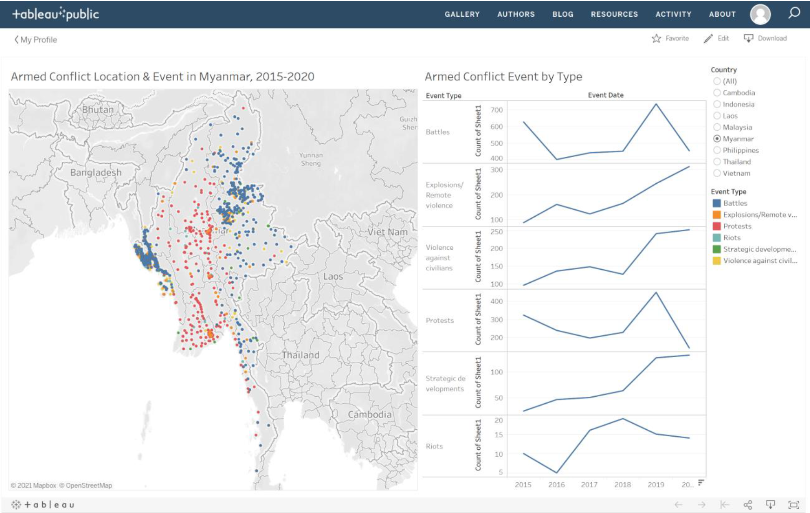

# Critiquing the Initial Visualization

### Interactivity

1. While the visualization is intended to be spatio-temporal, but there is no temporal interactivity option provided. User can't select a specific year or time period.

2. The selector for Country is not very flexible. Users can only select either one country or all. Therefore, this restricts the option to be able to look at data for multiple countries at a time. In addition, there is no way to isolate locations within each country using the visualization.

3. Manually selecting a data point on the map area does not change the graph section on the right. This does not enable the user to interact with the data to study it at a more detailed level.

### Clarity

1. It is not clear what parameter is being counted and graphed per Event Type - for example, it is not clear what Sheet 1 is.

2. The various event type graphs are not grouped together and this makes it very difficult for users to do a comparison between event type data.

3. A clear lead in statement is not provided. New users to the visualization, or any site where this visualization may be published, are unable to easily understand what is the data that is being visualized and what purpose the visualization serves them.

### Aesthetics

1. The geospatial visualization is only plotting the data points as they exist on the map, but does not enhance/bring out key patterns. For example, there is no proportional symbol technique being used to show the user the extent of fatalities  that occurred for any given events.

2. Showing a line graph per event type at annual level does not reveal much information except a macro trend (if it exists). 

## Suggestions for Alternate Visualization

The following table summarizes the key changes recommended to the initial visualization:

| Aspect | Critique Point Reference from above | Recommendation |
| :---: | :-----------------------------: | :-------------------------------------------------------: |
|   Interactivity   |   1   |  A time period selection option should be provided, with the flexibility for users to customize specific time windows.    |
|   Interactivity   |   2   |   As different users have different requirements, country selection options should be much more flexible. Users should be able to select multiple countries in any combination at a time, instead of only one or all. Furthermore, a location dropdown option should be provided, for the occasional detailed user who needs to isolate specific locations within countries to look at the data.   |
|   Interactivity   |   3   |   The selections on the visual map have to reflect respectively to the data points plotted on the graphs for event counts. Otherwise, it would defeat the purpose of an interactive visualization.   |
|   Clarity   |   1   |   For any graph shown on the visualization, proper axis labeling has to be done.   |
|   Clarity   |   2  |  Consolidate the data for each event type into one graph with multiple lines for easy comparison. In addition, the y-axis has to start from zero for fair comparisons.    |
|   Clarity   |   3   |   A lead in statement that captures the essence of the visualization must be provided, for users to gain familiarity with the data that they are interacting with.  |
|   Aesthetics   |   1   |   The Proportional symbol techniques should be used to make the map area visually meaningful as the user changes the parameter selections. |
|   Aesthetics   |   2   |  Graphing of event data should be done with shorter time intervals - either a monthly or quarterly level data. Since this data is available, it doesn't make sense to hide it away from the many users who would love to analyze the data in-depth.  |

# Preparing the Proposed Visualization with Tableau


## Importing Data into Tableau & Data Preparation

Drag and drop the Southeast Asia data file into Tableau Desktop. We observe that the required data fields are already correctly assigned in terms of data types: 

- Country, Latitude and Longitude are already correctly marked with Geographic data roles.

- Fatalities are already numeric values, which is what we require.

- Event Date is also marked correctly as Date & Time data type.

We are ready to create the visualization.


## Visualizing the Map Layer

1. Go to the Worksheet Tab to start creating the visualization. 

2. Drag and drop Longitude into Columns and Latitude into Rows field. This should be the initial output:

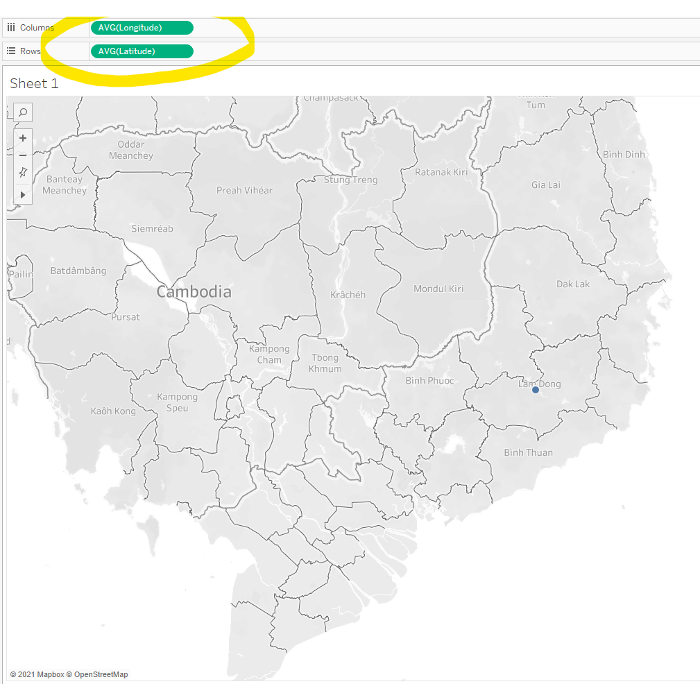

3. Unselect the "Aggregate Measures" options under the Analysis drop down:

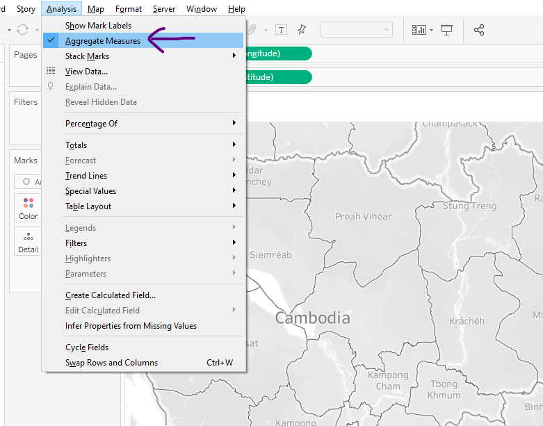

4. You should now see a full South East Asia Map view with all the data points spread across:

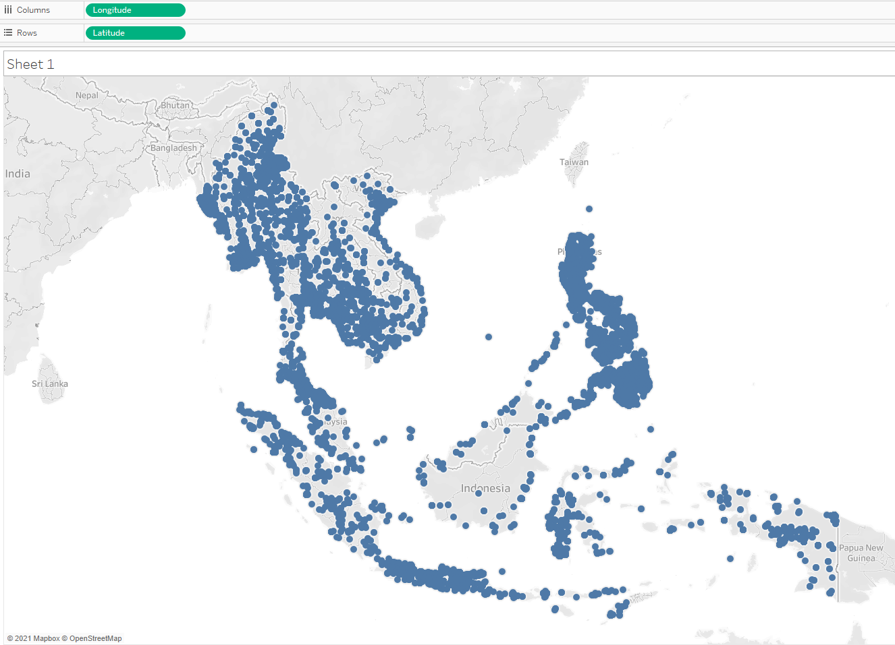

5. Change the Map Background to Dark:

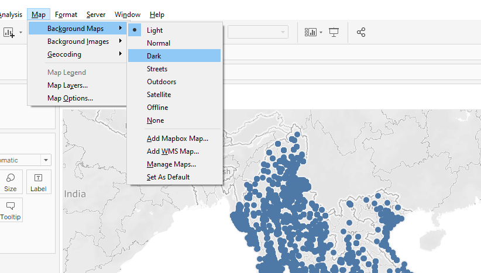

6. Now, drag "Event Type" into the Color option and "Fatalities" into the Size option. Adjust both Size and Opacity to ~50%:

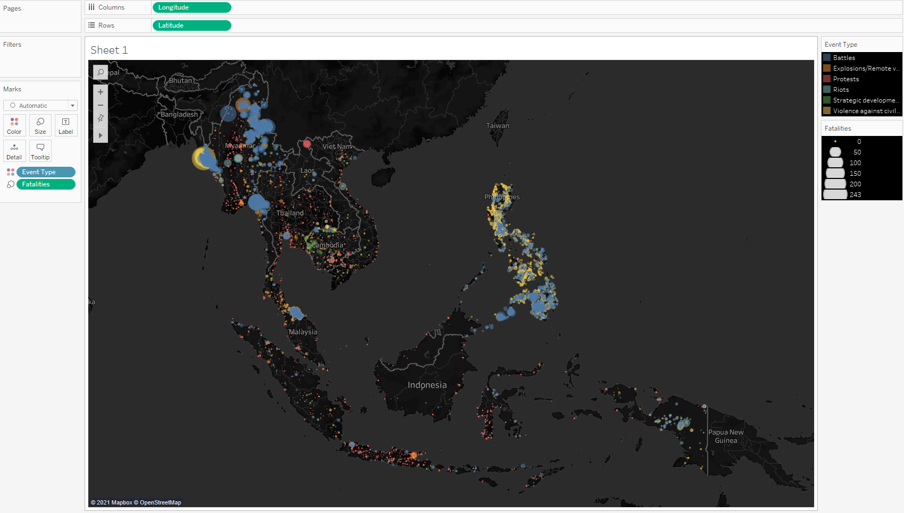

7. Add the following filters in the following formats:

- Country, as a multiple values List.

- Year, as a slider.

- Fatalities, as a slider.

- Location, as a single dropdown List.

**Show** all the above Filters. The output should look like this:


8. Change the Color theme to "Jewel Bright":


9. Add "Location" and "Country" as tool tips to make interactive reading on-the-go much easier to the user.

Mow, the visualization should look like this:


Name the worksheet "Map Viz". Now, we move on to creating the Event Graph, which will serve as the second part of the final Dashboard.


## Creating the Event Graph

1. Create a new Worksheet

2. Drag "Event Date" to Columns and "Event Id Cnty" to Rows. Expand "Event Date" into Quarterly view. Adjust "Event Id Cnty" value to a Distinct Count number. Finally, drag "Event Type" into Color Marks option:

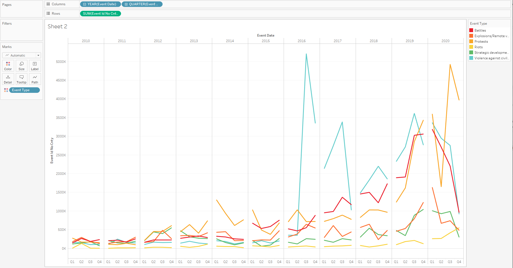

3. Format the axes to increase font size to 14 and Bold fonts. Label y-axis as "# of Events". Caption the graph as "Quarterly Breakdown of Event Occurrences". Hide the "Event Date" Field label. Finally, add in "Country" filter:

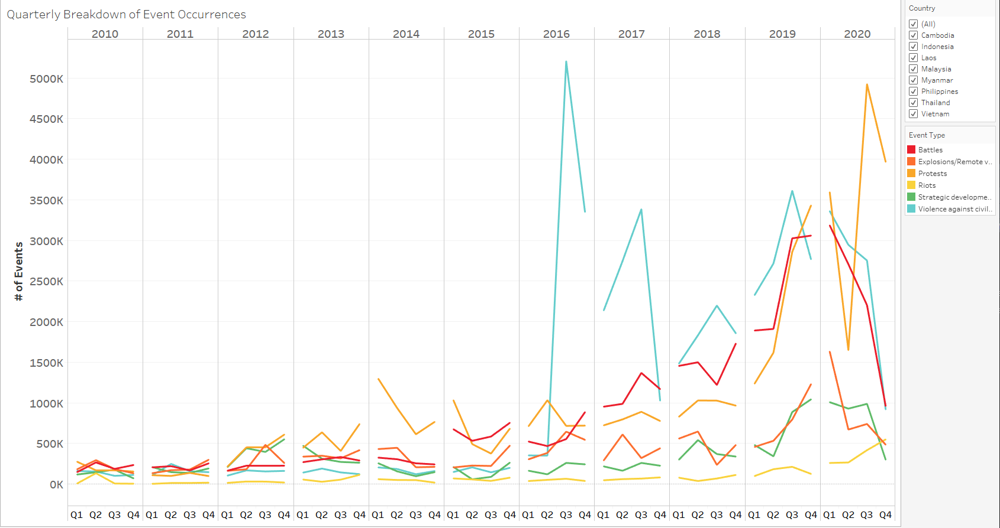

Name the worksheet "Event Graph". Now, we are ready to create the Dashboard.


## Creating the Dashboard

1. Click on "New Dashboard"

2. Set the Size to "Automatic"

3. Drag in the "Map Viz" sheet to the top half of the Dashboard and "Event Graph" sheet to the bottom half of the Dashboard:

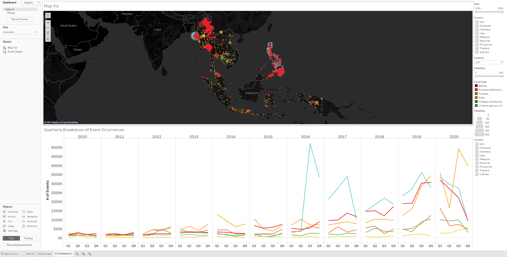

4. Re-adjust the tiling to enable the Event Graph to take the entire width of the dashboard.

5. Link all the filters to all worksheets as shown in the picture below:

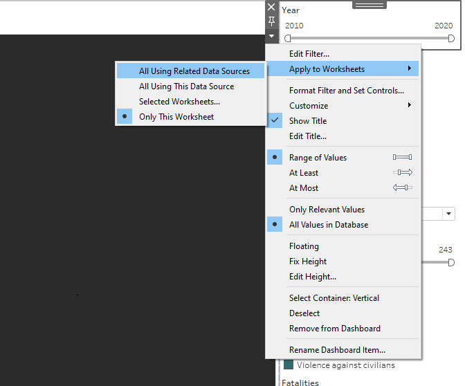

6. Click on "Show Dashboard Title" and give an appropriate title to the Dashboard.

7. Add the Source data information at the bottom of the dashboard.

# Final Visualization

The final interactive dashboard looks like this:

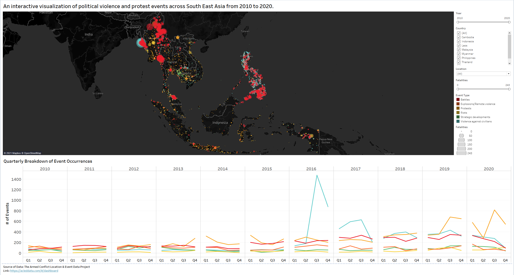

# Major Observations revealed by the Visualization

1. Out of the 38,244 events that took place in SEA over the decade 2010-2020, only approx. 31% of the events (11987) had fatalities. This is easily discovered by adjusting the "Fatalities" filter to start at 1 instead of 0, and then selecting the map area and checking the interactive tooltip for the count.

2. Approx. 68% of the events occurred in the second half of the decade (2016 to 2020), indicating a rise in political tensions in the region during this time period.

3. The strategic developments with fatalities happened mostly in Cambodia:

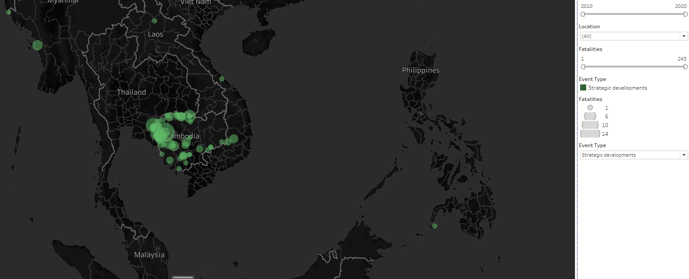

4. The highest number of fatalities are in Myanmar while the lowest number of fatalities were in Malaysia.

5. There were no conflict events in the Philippines from 2010 to 2015 and they only started in 2016. This is in line with President Duterte's election and the initiation of his war on drugs. 

# References

1. Tableau Help Guide - https://www.tableau.com/support/help
2. Fundamentals of Visualization - https://clauswilke.com/dataviz/
3. https://acleddata.com/#/dashboard

